# Estudo K6 Operator no Kubernetes

Estudo para avaliar o uso do K6 operator e seus beneficios ao utilizado com o Kubernetes.

## Pre Requisitos

- Docker
- Kubectl
- Microk8s (teste local)
- Javascript

## Instalando o operador

Para instalar o operador, existe diversas formas, sendo elas o uso do Helm ou do Kubectl. Para esse teste foi utilizado o Kubectl, executando o comando abaixo:

```sh
curl https://raw.githubusercontent.com/grafana/k6-operator/main/bundle.yaml | kubectl apply -f -
```

## Importando script de teste K6 para dentro do cluster Kubernetes

Para a importação do script pode ser utilizado duas ferramentas nativas do Kubernetes, sendo elas:

- ConfigMap
- PrivateVolumeClaim (PVC)

A principal diferença para definir o uso de qual utilizar é o tamanho do teste, pois o ConfigMap tem um limite de 1048576 bytes que pode ser carregado, em caso de um script que possui um tamanho maior que esse, deve ser utilizado o PVC.
Para esse teste será utilizado o ConfigMap, sendo apenas necessário executar o comando abaixo que irá criar um configMap baseado no script do teste:

```sh
kubectl create configmap test-k6 -n test-k6 --from-file ./k6/mainTest.js
```

## Executando Teste

Para executar o teste, é necessário criar uma artefato Kubernetes que é definido as configurações do teste de carga no Kubernetes, utilizando o ApiVersion `k6.io/v1alpha1`, nesse arquivo será configurado o paralelismo de jobs do teste que será criado e qual o ConfigMap que deve ser carregado. A seguir está o comando para a criação do artefato:

```sh
kubectl apply -f testRun.yaml
```

Pronto, será criado jobs no cluster kubernetes, baseado na quantidade de paralelismo que foi definido:

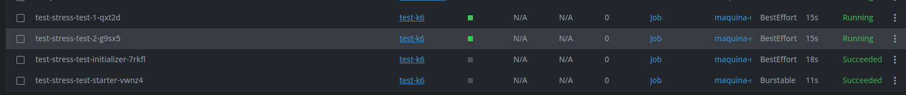

Após o job encerrar, é possivel ver pelo log do job o resultado do teste:

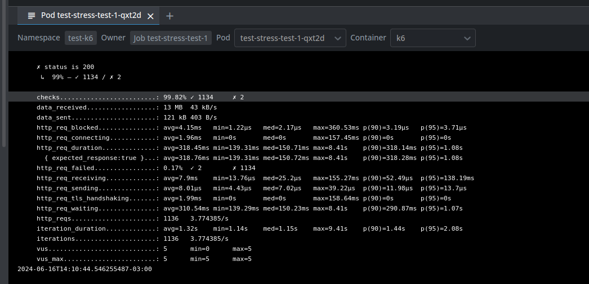

## Exportando Teste para o Grafana

Para ter uma visualização mais precisa do teste, é possivel exporta-la para ferramentas de captura de métricas (lista de todas as ferramentas suportadas [aqui](https://k6.io/docs/results-output/real-time/))

No caso do uso com o K6 operator, será necessário a criação de uma imagem Docker personalizada, que contem instalada o plugin para expor as métricas para a ferramenta de captura de métricas definidas.

Para o teste com o Microk8s, foi utilizada o InfluxDB como banco de dados para métricas e o Grafana para exibição dos dados em um Dashboard.

### Criando Banco de Dados InfluxDB

Para criar o banco de dados que será enviada as métricas, basta executar o comando a seguir:

```sh
kubectl apply -k influxdb/
```

Basta aguardar os pods do InfluxDB estar pronto.

### Subindo imagem customizada do K6

Para subir a imagem customizada com o plugin para exportar as métricas, primeiro deve ter ativo o plugin `registry`(Repositório de imagens para containers) e `observability`(instalação do Grafana) do Microk8s, e para ativa-lo basta executar o comando a seguir:

```sh
microk8s enable registry observability
```

Com o Registry ativo, basta executar os comandos a seguir para o envio da imagem:

```sh
# Build da imagem Docker
docker build -t localhost:32000/k6-extended-influxdb:1.0.0 .
```

```sh
# Envio da imagem Docker para o Registry do Microk8s
docker push  localhost:32000/k6-extended-influxdb:1.0.0
```

Pronto, o ambiente está preparado para a execução do teste.

### Criando Conexão com InfluxDB & Dashboard no Grafana

Agora será necessário criar o Dashboard que irá processar as informações do InfluxDB. Para isso deve seguir as orientações abaixo:

1. No painel do Grafana, acesse a opção de configuração:

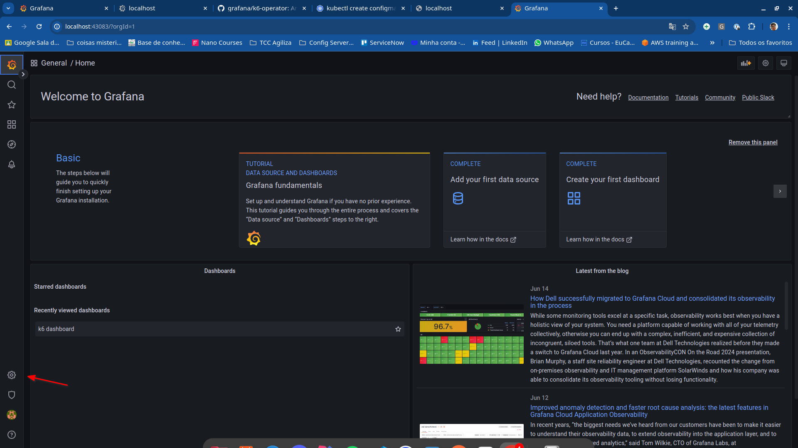

2. No painel de Configuração, selecione a opção `Add data source`:

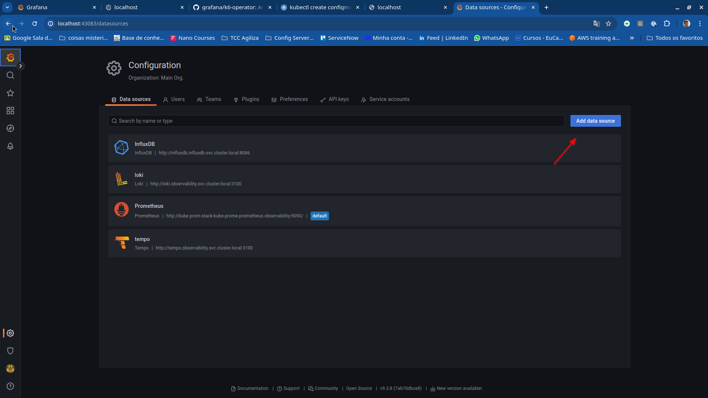

3. Selecione a opção ``ÌnfluxDB```:

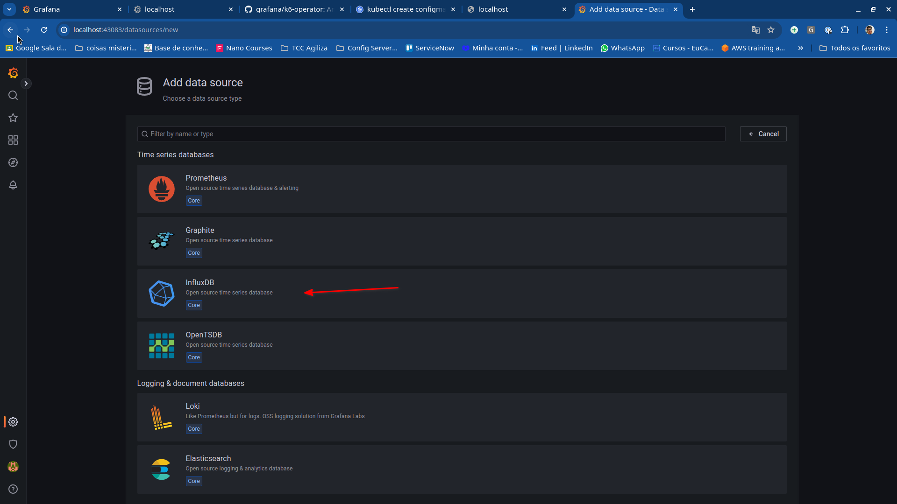

4.Preencha o formulário para a conexão com o InfluxDB, no exemplo a seguir está sendo preenchido para a conexão com o InfluxDB no Microk8s:

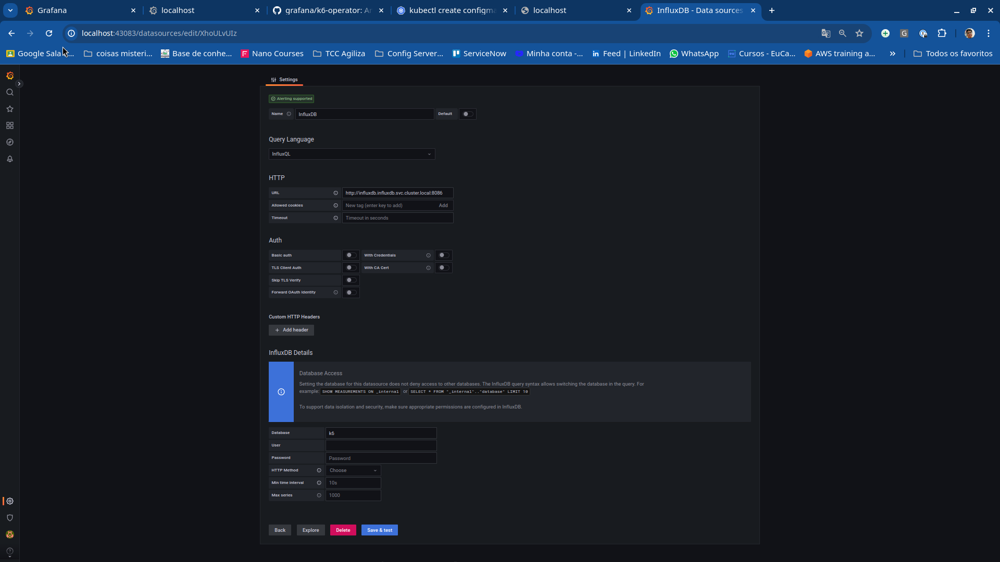

Pronto, agora será necessário importar o arquivo JSON do dashboard K6:

1.Na pagina principal do Grafana, selecione a opção de `Dashboards`:

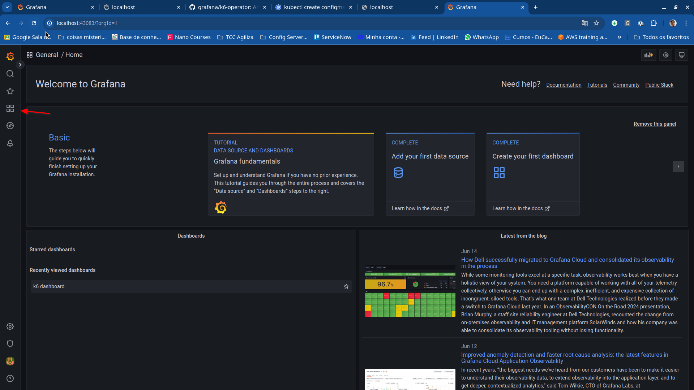

2. No Browser de Dashboards, selecione a opção `New` e na caixa de seleção, selecione `Import`:

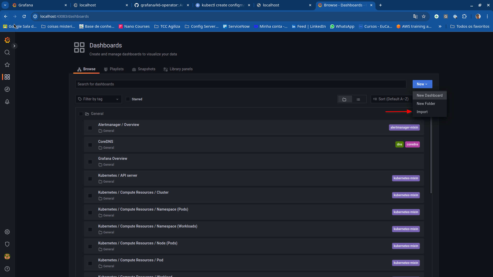

3. Selecione a opção `Upload JSON file` e selecione o arquivo que está dentro da pasta `Grafana-dashboard`:

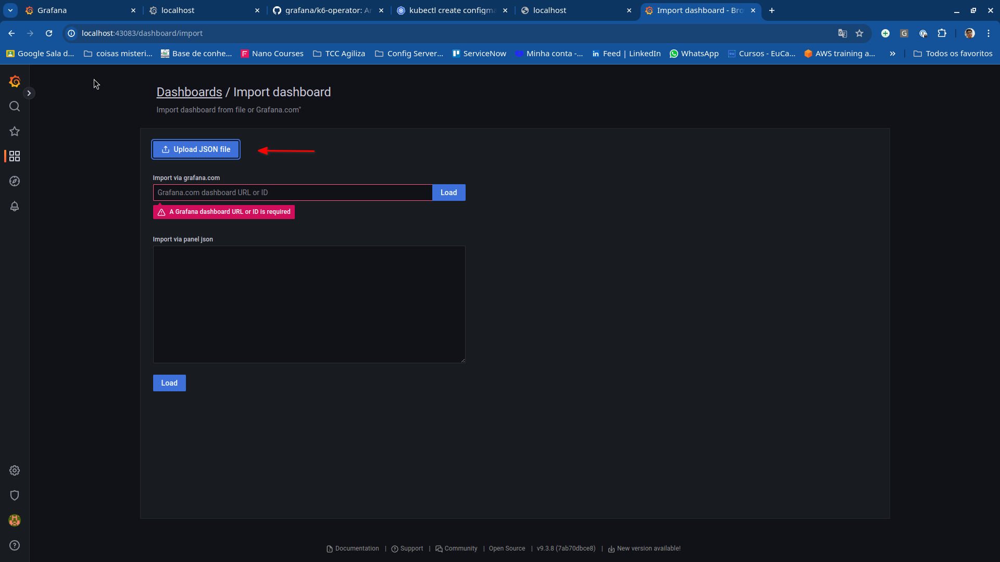

4. Agora basta selecionar a opção `Import` na janela de opções do Dashboard que será criado:

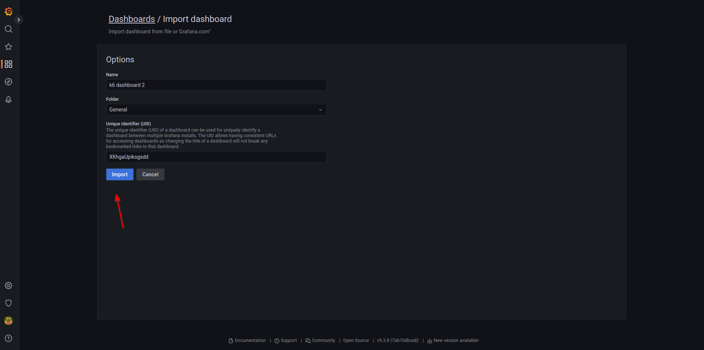

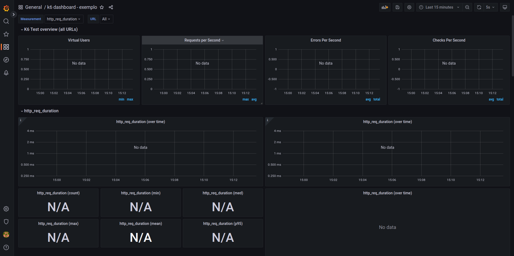

### Executando teste e monitorando métricas

Para executar o teste, deve ser configurado no artefato Kubernetes qual imagem Docker deve ser carregada, neste cenário de teste, será ajustado para que utilize a imagem com o plugin do influxDB e definia a variavel de ambiente que define qual a url do influxDB que o K6 irá enviar as métricas:

```yaml
apiVersion: k6.io/v1alpha1
kind: TestRun
metadata:
  name: k6-sample-with-extensions
  namespace: test-k6
spec:
  parallelism: 2
  script:
    configMap:
      name: "test-k6"
      file: "mainTest.js"
  runner:
    image: localhost:32000/k6-extended-influxdb:1.0.0
    env:
      - name: K6_OUT
        value: xk6-influxdb=http://influxdb.influxdb.svc.cluster.local:8086/k6
```

com o arquivo configurado, basta executar o teste novamente com o comando a seguir:

```sh
kubectl apply -f testRunCustomImage.yaml
```

Pronto, com o teste iniciado, ao acessar o Dashboardo o Grafana, irá ver que as métricas irão aparecer conforme o teste é realizado:

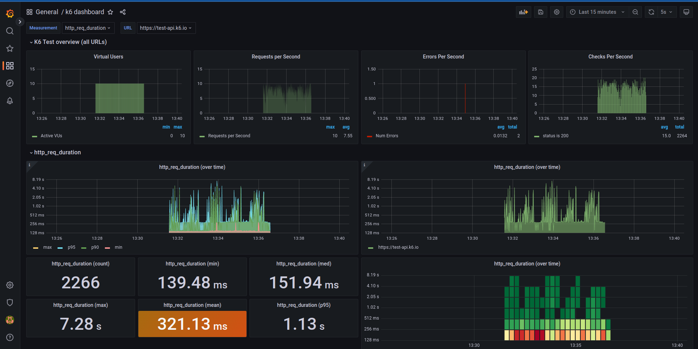

## Limpeza do ambiente após o teste

Após o teste e a captura das métricas, deve ser realizado a limpeza dos artefatos criados no kubernetes, removendo os jobs do K6 e o ConfigMap que contém o script de teste. Para a limpeza deve executar o comando a seguir:

```bash
#Deleta script de teste
kubectl delete -f testRunCustomImage.yaml

#Deleta ConfigMap
kubectl delete configmap test-k6 -n test-k6
```

A limpeza garante que os recursos utilizados durante o testes sejam disponibilizados para que seja utilizada por outras aplicações no cluster kubernetes.

## Referencias

[K6 Operator - Github](https://github.com/grafana/k6-operator)
